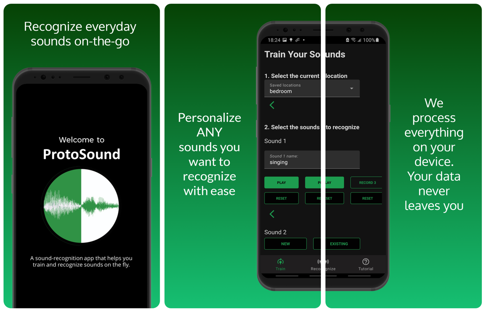
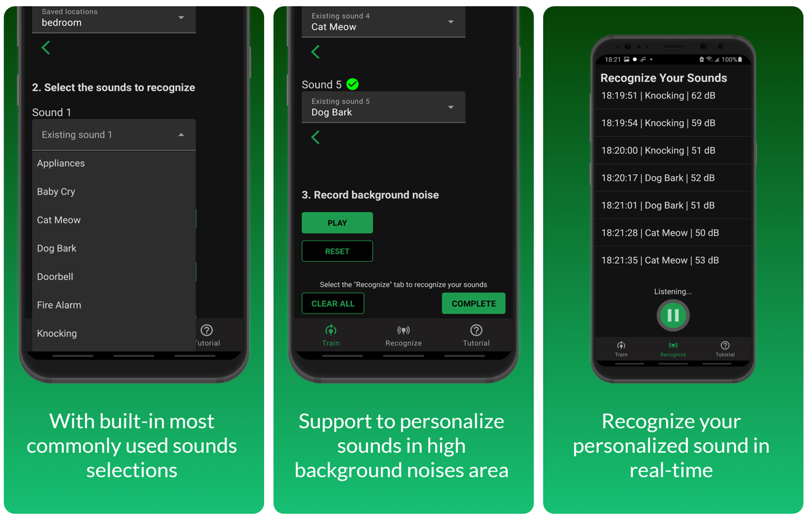

## Introduction ##

This is an android-based implementation of ProtoSound with our pre-trained MobileNetV2 model.

[[Website](https://makeabilitylab.cs.washington.edu/project/protosound/)] 
[[Paper PDF](https://homes.cs.washington.edu/~djain/img/portfolio/Jain_ProtoSound_CHI2022.pdf)] 
[[Video](https://homes.cs.washington.edu/~djain/img/portfolio/protosound-video.mp4)] 
## Table Of Contents

0. [Prerequisite](#prerequisites)
1. [Screenshots](#screenshots)
2. [Configuration](#configuration)
3. [Frequently Asked Questions](#frequently-asked-questions)
4. [Support](#support)
5. [Acknowledgement](#acknowledgement)
6. [Related Work](#related-work)

## Prerequisites ##  

- Latest Android Studio (The project is developed with Android Studio 4.0)
- Android SDK 28
- Android Build Tools v28.0.3
- Android Support Repository
- Get the sound classification Tensorflow lite model and the label files that are open sourced [here](https://www.dropbox.com/sh/wngu1kuufwdk8nr/AAC1rm5QR-amL_HBzTOgsZnca?dl=0)

## Screenshots ##  

## Configuration ##  

- Let gradle configure and install dependencies for the `app` project.
- On top toolbar of Android Studio, make sure `app` is chosen and click `Run` button.

## Frequently Asked Questions ##

<b>How does the option "New" in step 2 work?</b>
- You are prompted to enter a name for your sound and record the sound 5 times. Each recording is 1-second long, which means there are 5 1-second samples. You can play the recording back to see if it is the sound that you want. You can also record again for the same slot when you tap on the "Recorded" button.

<b>Will my submitted locations and self-recorded sounds be saved?</b>
- Yes. Once you submit a location in step 1, the location is saved and you can access it again when you choose <b>Existing</b> for step 1. As for your recorded sounds, once you train the model, the sounds will be saved with the associated location for later access.  
  For example, if you save "talking" with your location "bedroom". If you select "bedroom" from step 1, "talking" will be in the list of sounds when you choose EXISTING in step 2.

<b>Why does Predict not return any result for my sound?</b>
- There are a couple of reasons. You might not have trained the sounds yet or the app simply does not recognize your untrained sound.

<b>Why does Predict return incorrect results for a sound when I have trained it?</b>
- It could be that within your trained dataset, there is low variance among the different sounds which leads to high errors. Alternatively, if a sound is trained through "Your Choice", the 5 recordings may capture vastly different sound waves for a particular sound and this can lead to inconsistencies when getting predictions.

<b>After training 5 sounds, can I train different sounds?</b>
- Yes. After training 5 sounds, you can make necessary changes on the <b>Train</b> tab then tap on "TRAIN" to train the sounds again.

## Support ##  

- Developed with [Dhruv Jain](https://homes.cs.washington.edu/~djain/) and collaborators at [MakeabilityLab](https://makeabilitylab.cs.washington.edu/)
- Contact [Khoa Nguyen](https://www.linkedin.com/in/akka/) @MakeabilityLab through email `akhoa99` at cs.washington.edu
- Contact [Quan Dang](https://www.linkedin.com/in/quangary/) @MakeabilityLab through email `quangary` at cs.washington.edu
- Contact [Hung V Ngo](https://www.hungvngo.com) @MakeabilityLab through email `hvn297` at cs.washington.edu

Drop us a note if you are using or plan to use ProtoSound for research purposes. We are also happy to help with any questions or issues.

## Acknowledgement ##  

- Audio bytes are written to and read from .wav files with the use of [Wav Files - The Lab Book Pages](http://www.labbookpages.co.uk/audio/wavFiles.html).
- The ML model depends on [JLibrosa](https://github.com/Subtitle-Synchronizer/jlibrosa) to convert raw audio sounds to MFCC features.

## Related Work ##  

- [SoundWatch](https://makeabilitylab.cs.washington.edu/project/soundwatch/): SoundWatch: Exploring Smartwatch-based Deep Learning Approaches to Support Sound Awareness for Deaf and Hard of Hearing Users
- [HomeSound](https://makeabilitylab.cs.washington.edu/project/smarthomedhh/): An Iterative Field Deployment of an In-Home Sound Awareness System for Deaf or Hard of Hearing Users  
